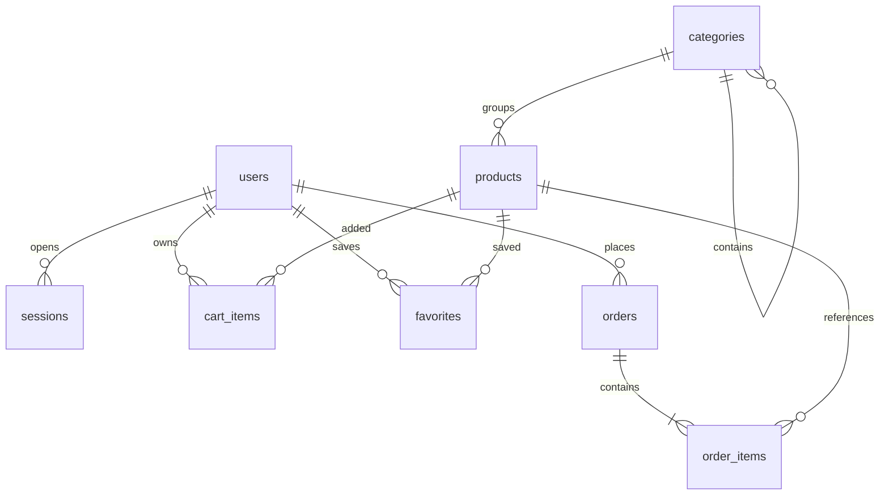

# API та модель даних

Базова адреса: `http://127.0.0.1:3000/api`. Усі відповіді — JSON; помилка має вигляд `{ "error": "Повідомлення українською" }`.
Суми в API — **цілі копійки**, наприклад `115000` означає `1150 ₴`.

## Автентифікація

Для запитів, які змінюють дані, потрібен заголовок `X-Requested-With: svit-shop`.
Після входу також передавайте `X-CSRF-Token`, отриманий у відповіді входу або `GET /auth/me`.
Браузер сам передає HttpOnly cookie `sid`; JavaScript не має читати її.

| Метод | Шлях             | Призначення                                          |
| ----- | ---------------- | ---------------------------------------------------- |
| POST  | `/auth/register` | `{ name, email, password }`, створює покупця й сесію |
| POST  | `/auth/login`    | `{ email, password }`, відкриває сесію               |
| GET   | `/auth/me`       | `{ user, csrfToken }`; для гостя обидва `null`       |
| POST  | `/auth/logout`   | Закриває сесію                                       |

Пароль — 10–128 символів. Роль із форми реєстрації ігнорується: завжди `customer`.
Сесія живе 7 діб; токен у БД зберігається лише як SHA-256-хеш. Вхід і реєстрація обмежені 30 спробами за 15 хвилин з однієї IP-адреси.

## Каталог

| Метод | Шлях            | Призначення                                              |
| ----- | --------------- | -------------------------------------------------------- |
| GET   | `/categories`   | Усі категорії: `id`, `name`, `slug`, `parent_id`, `icon` |
| GET   | `/brands`       | Бренди активних товарів                                  |
| GET   | `/products`     | `{ items, total, page, pages }`                          |
| GET   | `/products/:id` | Детальна картка активного товару                         |

Параметри `/products`: `q`, `category` (id), `brand`, `min`, `max` (у гривнях), `age` (0–18), `stock=1`, `sale=1`, `favorites=1`, `sort`, `page`, `limit` (1–48).
Сортування: `newest`, `price_asc`, `price_desc`, `title`. Категорія включає всі свої підкатегорії. Вік 6 показує товари з мінімальним рекомендованим віком 0–6 років.

Приклад: `/products?category=1&stock=1&min=500&max=1500&sort=price_asc`.

## Кошик, обране та замовлення

Усі маршрути цього розділу потребують входу.

| Метод | Шлях             | Тіло / результат                           |
| ----- | ---------------- | ------------------------------------------ |
| GET   | `/cart`          | `{ items, total }`                         |
| PUT   | `/cart/:id`      | `{ quantity: 0..99 }`; 0 видаляє позицію   |
| GET   | `/favorites`     | Масив id товарів                           |
| PUT   | `/favorites/:id` | `{ saved: true/false }`                    |
| GET   | `/orders`        | Власні замовлення разом із позиціями       |
| POST  | `/orders`        | Створення замовлення зі збереженого кошика |

```json
{
  "name": "Тестовий Покупець",
  "phone": "+380000000000",
  "delivery": "pickup",
  "address": "",
  "payment": "offline",
  "note": "Навчальне замовлення"
}
```

`delivery`: `pickup` або `delivery`. Для другого варіанта адреса обов'язкова.
Передавайте заголовок `Idempotency-Key` із UUID; при повторі запиту використовуйте той самий ключ. Повернеться існуюче замовлення без повторного списання залишків.
Нова покупка потребує нового ключа. Ціни, підсумок і власника сервер визначає сам.

## Адміністрування

Потрібні сесія та роль `admin`. Інтерфейс адміністратора сам по собі не є захистом: кожен API-запит перевіряється сервером.

| Метод       | Шлях                    | Призначення                                             |
| ----------- | ----------------------- | ------------------------------------------------------- |
| GET         | `/admin/summary`        | Лічильники і сума виконаних замовлень                   |
| GET, POST   | `/admin/products`       | Усі товари / створення                                  |
| PUT         | `/admin/products/:id`   | Повне редагування товару                                |
| DELETE      | `/admin/products/:id`   | Приховування (`active=0`)                               |
| POST        | `/admin/categories`     | Створення категорії                                     |
| PUT, DELETE | `/admin/categories/:id` | Редагування / видалення порожньої категорії             |
| GET         | `/admin/orders`         | Усі замовлення                                          |
| PATCH       | `/admin/orders/:id`     | `{ status }`                                            |
| GET         | `/admin/users`          | Користувачі без хешів паролів                           |
| PATCH       | `/admin/users/:id`      | `{ role: "customer"/"admin", active: 0/1 }`             |
| POST        | `/admin/uploads`        | `multipart/form-data`, одне поле файлу `image`, до 5 МБ |

Товар: `title`, `description`, `category_id`, `brand`, `age_min`, `price`, `old_price` (`null` без знижки), `stock`, `image`, `active`.
Категорія: `name`, `slug`, `parent_id` (`null` для основної), `icon`.
Цикли категорій заборонені. Категорію з товарами (навіть прихованими) або підкатегоріями не можна видалити.
Фото — локальні шляхи `/img/...` або `/uploads/...`; URL сторонніх сайтів не приймаються. Перевіряються сигнатури PNG/JPG/WebP; користувацькі SVG не завантажуються.
Власну роль/активність адміністратор не змінює. Зміна іншого користувача закриває його сесії.

Статуси замовлення:

```text
new → confirmed → shipped → completed
  ↘ cancelled   ↘ completed
                ↘ cancelled
```

Точні переходи: `new → confirmed/cancelled`, `confirmed → shipped/completed/cancelled`, `shipped → completed`.
`completed` і `cancelled` — кінцеві стани. При скасуванні залишки повертаються; при завершенні офлайн-оплата позначається `paid`.

## Зв'язки таблиць



`order_items.title`, `image`, `price` — копія стану на момент покупки. Вона не змінюється після редагування товару.
`BEGIN IMMEDIATE` об'єднує перевірку складу, створення замовлення, позиції, списання залишків та очищення кошика. Будь-яка помилка виконує `ROLLBACK`.
Схема версії 1 створюється при запуску. Для майбутніх змін структури додайте послідовні міграції; `CREATE TABLE IF NOT EXISTS` не змінює наявні стовпці.
